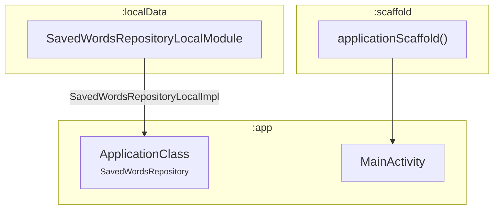
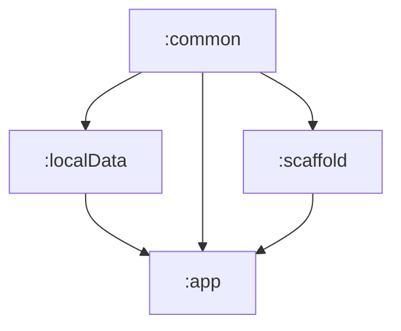

# 📦 Module :app

## 📝 Overview

The main application module that serves as the entry point for the application.

### 🔧 Key Functionalities

- Serves as the main entry point for the Android application
- Configures Hilt dependency injection for the entire app
- Manages application lifecycle and initialization
- Provides the main activity that initializes the composable function `applicationScaffold`
- Defines app permissions and manifest configuration

---

## 🧠 Class Responsibilities

### ``ApplicationClass``
The main application class annotated with `@HiltAndroidApp` that initializes Hilt dependency injection
for the entire application. Loads users data saved locally onCreate.

### ``MainActivity``
The main activity of the application that serves as the entry point for user interaction. It's annotated
with `@AndroidEntryPoint` for Hilt integration and uses Jetpack Compose to render the UI through the
`applicationScaffold()` composable. Enables edge-to-edge display.

---

## 🧬 Class dependency graph

## 🧩 Module dependency graph
Shows which modules depend on `:app` and which modules `:app` itself depends on.

