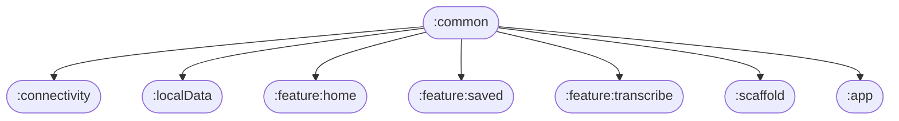

# 📦 Module :common

## 📝 Overview

A shared module containing pure Kotlin code used throughout the app, such as sealed classes, data classes, and
interfaces. It serves as a central location for reusable, platform-independent logic. Also includes Hilt modules
and coroutine qualifiers for dependency injection, navigation-related classes, and a centralized object
for storing UI component test tags to simplify their management.

### 🔧 Key Functionalities

- Provides non-API-specific Kotlin files that allow modules to communicate without depending on concrete implementations.
- Manages test tags for UI elements in a centralized and maintainable way.

---

## 🧠 Class Responsibilities

| Class/File   | Responsibility Description                                |
|--------------|-----------------------------------------------------------|
| `Navigation` | SSOT for navigating using Compose's Navigation component. |
| `Screens`    | Defines all screens available in the app.                 |

---

## 🧬 Class Dependency Graph
Dependency flow within the module. *(Nothing to show)*

## 🧩 Module Dependency Graph
Shows which modules depend on `:common`.

