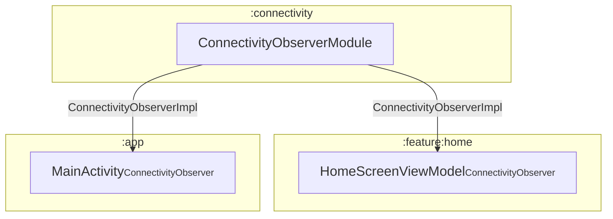
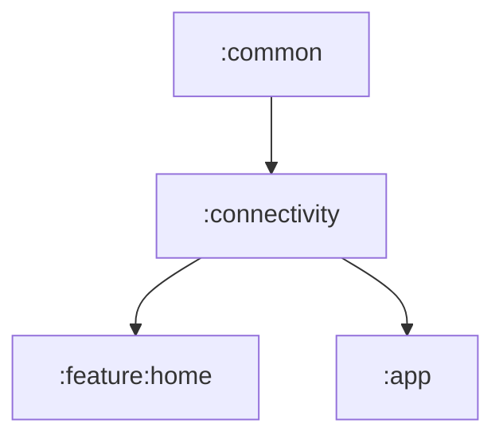

# 📦 Module :connectivity

## 📝 Overview

A module responsible for monitoring and exposing the device's internet connectivity status using Android’s
`ConnectivityManager`. It provides a clean, platform-aware implementation to observe real-time network changes and expose
them with a `callbackFlow`, enabling other modules to react to connectivity updates in a decoupled manner.

### 🔧 Key Functionalities

- Manages device's WiFi & Cellular data connectivity.

---

## 🧠 Class Responsibilities

### ``ConnectivityObserverImpl``
An internal implementation of the `ConnectivityObserver` interface that provides real-time updates on the device's internet connectivity status (Wi-Fi and cellular) as a Kotlin Flow.
It leverages Android's `ConnectivityManager` and `NetworkCallback` to observe network state changes, such as connection availability, loss, and capability changes.
When a change is detected, it emits the corresponding ConnectivityStatus (either Connected or Disconnected) to its subscribers.

### ``ConnectivityObserverModule``
A Hilt module that provides a singleton instance of `ConnectivityObserverImpl` wherever `ConnectivityObserver` is requested.

---

## 🧬 Class dependency graph

## 🧩 Module dependency graph
Displays which modules depend on `:connectivity` and which modules `:connectivity` itself depends on.
