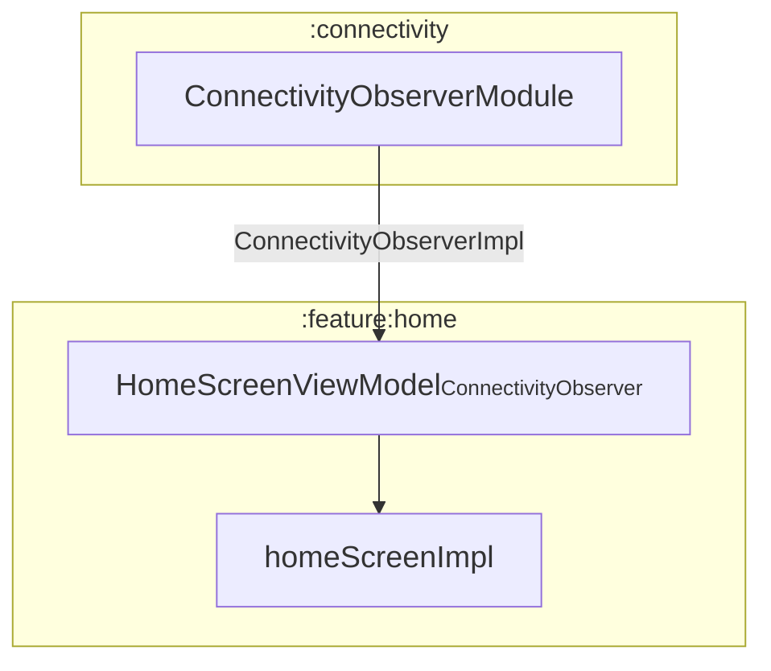
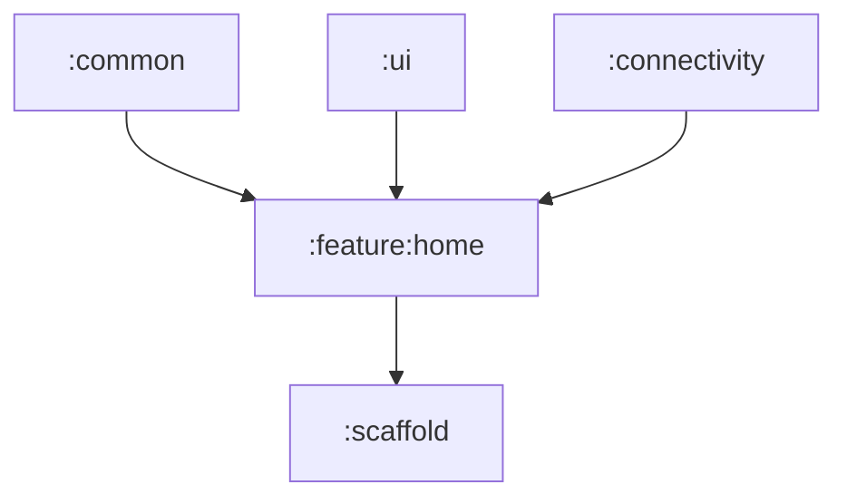

# 📦 Module :feature:home

## 📝 Overview

A module responsible for displaying the Home screen, which serves as the entry point of the app. It provides navigation  
to core features such as managing saved words and generating transcriptions. The module integrates with `:connectivity`,  
notifying the user when the device is offline — since the app’s core features depend on a cloud API.  
It encapsulates UI logic, state management, and event handling specific to the Home screen.

### 🔧 Key Functionalities

- Provides Home screen.
- Displays a notification when the device is offline, indicating limited feature availability.
- Enables navigation to `SavedWordsScreen` and `SelectAudioScreen`.

---

## 🧠 Class Responsibilities

### ``HomeScreen``
Stateless composable function that presents the UI. Allows the user to navigate to `SavedWordsScreen` or  
`SelectAudioScreen`, and displays connectivity status when offline.

### ``HomeScreenViewModel``
Manages the UI state of `HomeScreen`. Depends on `ConnectivityObserver` to reflect network status.

### ``HomeScreenImpl``
Combines `HomeScreen` and `HomeScreenViewModel`. Defined as an extension function on `NavGraphBuilder`, integrating  
the entire Home screen flow into the Compose-based navigation system (see `:scaffold` for more).

---

## 🧬 Class dependency graph

## 🧩 Module dependency graph
Displays which modules depend on `:connectivity` and which modules `:connectivity` itself depends on.
