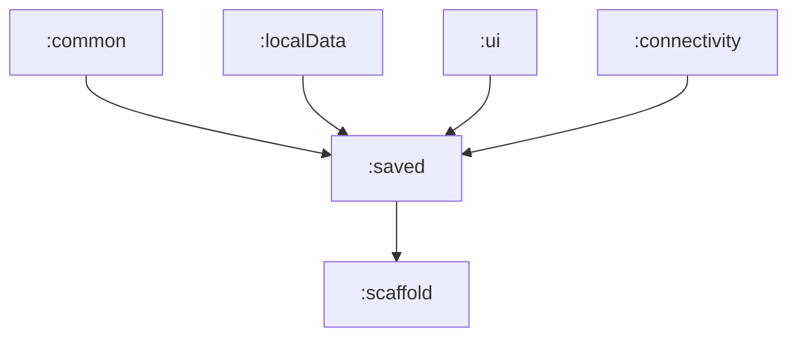

# 📦 Module :saved

## 📝 Overview

A feature module responsible for managing locally saved words. This module provides three main features: viewing/managing saved words, exporting them, and handling export results. It follows Clean Architecture principles with clear separation of concerns, implements modern Android development practices using Jetpack Compose and architectural patterns such as MVVM, MVI and DI.

### 🔧 Key Functionalities

- [**SavedWords**](src/main/java/eu/project/saved/savedWords/README.md): Display, manage, and delete saved words with confirmation dialogs
- [**ExportWords**](src/main/java/eu/project/saved/exportWords/README.md): Select and export saved words with various export methods
- [**ExportResult**](src/main/java/eu/project/saved/exportResult/README.md): Handle export operation results and file saving operations

---

## 🏗️ Architecture

The module follows a layered architecture pattern with the following structure:

```
saved/
├── savedWords/       # Saved words management feature
├── exportWords/      # Export functionality feature
└── exportResult/     # Export result handling and file saving
```

### 🧬 Module dependency graph

