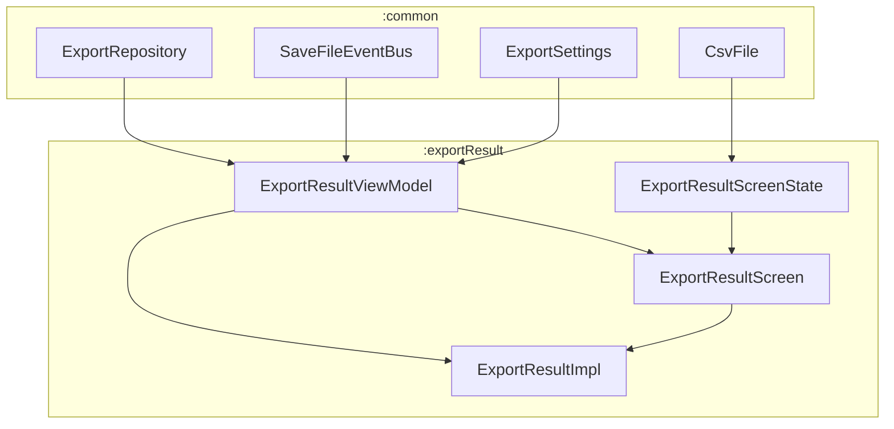
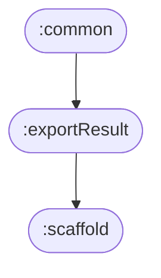

# 📦 Directory :exportResult

## 📝 Overview

The export result feature handles the final step of the word export workflow. It displays the result of the CSV export operation and provides options to save the exported file to the device or handle various error states. This feature manages the complete lifecycle from receiving export settings to successfully saving the CSV file.

### 🔧 Key Functionalities

- Displays export operation results and status
- Handles CSV file download and preparation for saving
- Manages file save operations through the system file picker
- Provides error handling for failed downloads and save operations
- Shows loading states during export operations
- Integrates with the event bus system for file save coordination

---

## 🧠 Class Responsibilities

### ``ExportResultScreenState``
Sealed class defining all possible states of the export result screen:
- `Loading` - Initial loading state while processing export settings
- `ReadyToSaveFile` - CSV file successfully prepared and ready for saving
- `FailedToLoadFile` - Error occurred during CSV file generation
- `SavingFile` - File save operation in progress
- `FileSavedSuccessfully` - File successfully saved to device
- `SaveFileError` - Error occurred during file save operation

### ``ExportResultViewModel``
Manages the business logic for the export result feature:
- Processes export settings and initiates CSV download
- Handles file save operations through the event bus
- Manages screen state transitions based on export and save events
- Coordinates with the ExportRepository for CSV generation
- Provides user actions for saving files and error recovery

### ``ExportResultScreen``
Main composable screen that orchestrates the UI based on current state:
- Renders different content based on the current screen state
- Handles user interactions and delegates actions to the ViewModel
- Provides navigation callbacks for error recovery and completion
- Manages the overall layout and content arrangement

### ``ExportResultImpl``
Navigation implementation that integrates the feature into the app:
- Sets up the composable route for the export result screen
- Manages navigation parameters (export settings)
- Handles navigation callbacks for back navigation
- Integrates with Hilt for dependency injection

### ``ExportResultReadyToSaveFileContent``
UI component for when the CSV file is ready to be saved:
- Displays download illustration and success message
- Provides "Save Exported Words" button
- Shows explanatory text about the export process

### ``ExportResultSaveFileErrorContent``
UI component for file save errors:
- Displays error message and illustration
- Provides "Try Again Later" button for error recovery
- Shows user-friendly error information

### ``ExportResultSavingFileContent``
UI component for the file saving process:
- Shows loading state during file save operation
- Provides visual feedback that save is in progress

### ``ExportResultFileSavedSuccessfullyContent``
UI component for successful file save:
- Displays success message and illustration
- Provides "Continue" button to proceed
- Confirms successful file save operation

### ``ExportResultLoadingContent``
UI component for initial loading state:
- Shows loading animation while processing export settings
- Provides visual feedback during CSV generation

### ``ExportResultFailedToLoadContent``
UI component for download failures:
- Displays error message and illustration
- Provides "Try Again Later" button for error recovery
- Shows user-friendly error information for download failures

---

## 🧬 Class Dependency Graph

## 🧩 Module Dependency Graph

