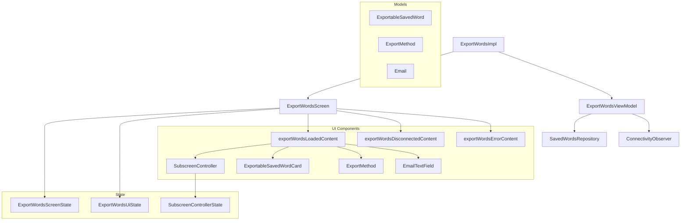

# 📦 Directory exportWords

## 📝 Overview

A directory responsible for exporting saved words with various export methods including email and device download. It provides a comprehensive UI for selecting words, choosing export methods, configuring settings, and handling the export process. The directory implements a multi-step workflow with subscreen navigation, follows MVI architecture.

### 🔧 Key Functionalities

- Select words for export
- Choose between email and device download export methods
- Configure export settings (email address, file format)
- Handle connectivity states and offline scenarios
- Multi-step workflow with subscreen navigation
- Real-time state management with reactive UI updates

---

## 🧠 Class Responsibilities

### `ExportWordsScreen`
Main screen composable that orchestrates the export workflow based on screen state. Handles conditional rendering for different states (Loading, Error, Disconnected, Loaded) and manages subscreen navigation.

### `ExportWordsViewModel`
Complex ViewModel managing the export workflow business logic. Handles data flow from repository, connectivity monitoring, subscreen navigation, and export method selection. Uses reactive programming with StateFlow and combines multiple data streams.

### `ExportWordsScreenState`
Sealed class representing the main screen states:
- `Loading`: Initial loading state
- `Error`: Error state when data cannot be loaded
- `Disconnected`: Offline state when no internet connection
- `Loaded`: Successfully loaded and ready for export

### `ExportWordsUiState`
Data class containing the complete UI state including:
- Words to export with selection state
- Current subscreen
- Export method selection
- Export settings

### `SubscreenController`
Manages navigation between different subscreens in the export workflow:
- `SelectWords`: Word selection interface
- `ExportSettings`: Export method and configuration

### `ExportMethod`
Enum defining available export methods:
- `SendToEmail`: Export via email
- `DownloadToDevice`: Download to device storage
- `NotSpecified`: No method selected

### `ExportableSavedWord`
Data class representing a word that can be exported with selection state and conversion methods to/from the domain model.

### `ExportableSavedWordCard`
UI component for displaying selectable words with checkbox functionality and proper accessibility support.

### `ExportMethod`
UI component for displaying export method options with visual feedback for selection state.

### `EmailTextField`
Specialized text field for email input with validation and proper keyboard configuration.

### `SubscreenController`
Navigation component managing transitions between different workflow steps with proper state management.

### `exportWordsLoadedContent`
Main content when data is loaded, displays the current subscreen content and manages user interactions.

### `exportWordsDisconnectedContent`
Shows offline state with connectivity information and user guidance.

### `exportWordsErrorContent`
Displays error state with retry functionality and user-friendly error messages.

---

## 🧬 Class dependency graph

