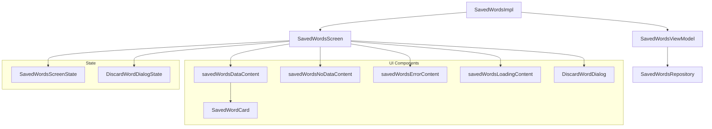

# 📦 Directory savedWords

## 📝 Overview

A directory responsible for managing locally saved words. It provides a complete UI for viewing saved words, deleting them with confirmation dialogs, and handling various states including loading, error, and empty states. The directory follows MVVM architecture.

### 🔧 Key Functionalities

- Display saved words in a scrollable list
- Delete words with confirmation dialogs
- Handle loading, error, and empty states
- Navigate to audio selection when no words are available
- Reactive state management with proper error handling

---

## 🧠 Class Responsibilities

### `SavedWordsScreen`
Main screen composable that orchestrates the UI based on screen state. Handles conditional rendering for different states (Loading, Error, NoData, Data) and manages dialog visibility.

### `SavedWordsViewModel`
Manages the business logic and state for the saved words feature. Handles data flow from repository, manages dialog states, and provides user interaction callbacks. Uses reactive programming with `StateFlow` for state management.

### `SavedWordsScreenState`
Sealed class representing the different states of the screen:
- `Loading`: Initial loading state
- `Error`: Error state with cause message
- `Loaded.NoData`: No saved words available
- `Loaded.Data`: Successfully loaded saved words

### `DiscardWordDialogState`
Sealed class managing the confirmation dialog state:
- `Hidden`: Dialog is not visible
- `Visible`: Dialog is shown with word to delete

### `SavedWordsImpl`
Navigation implementation that sets up the screen with dependency injection and handles navigation callbacks. Integrates with `Hilt` for ViewModel injection.

### `SavedWordCard`
UI component for displaying individual saved words with delete functionality. Shows word text, language, and delete button with proper accessibility support.

### `DiscardWordDialog`
Confirmation dialog for word deletion with proper user feedback and accessibility features.

### `savedWordsDataContent`
Displays the list of saved words using LazyColumn with proper spacing and alignment. Handles individual word card rendering and delete callbacks.

### `savedWordsNoDataContent`
Shows empty state with call-to-action to navigate to audio selection screen. Provides user guidance when no words are saved.

### `savedWordsErrorContent`
Displays error state with retry functionality and user-friendly error messages.

### `savedWordsLoadingContent`
Shows loading indicator while data is being fetched from the repository.

---

## 🧬 Class dependency graph

