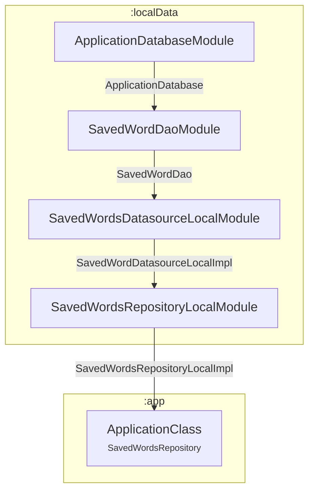
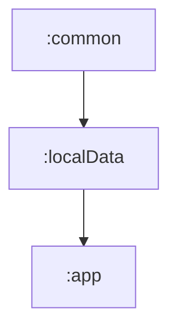

# 📦 Module :localData

## 📝 Overview

A module responsible for implementing the local persistence layer using Room. It defines the Room database along with
all required components, such as entities, DAOs, and type converters. The module also provides concrete implementations
of repository and datasource interfaces, enabling decoupled access to local data. These implementations are exposed to
other modules via Hilt for dependency injection.

### 🔧 Key Functionalities

- Implements the complete logic to access data stored in Room local database.
- Provides implementations of datasource and repository interfaces to other modules

---

## 🧠 Class Responsibilities

### ``ApplicationDatabase``
Defines the database configuration and serves as the main access point to persisted data. 
Contains the `SavedWordEntity` table and uses `UUIDConverter` for type conversion.

### ``ApplicationDatabaseModule``
A Hilt module for injecting ApplicationDatabase as a singleton.

### ``ApplicationDatabaseConstants``
File containing constants related with `ApplicationDatabase`.

### ``SavedWordDAO``
Interface which defines possible CRUD actions to be performed over the table `saved_words`.

### ``SavedWordDAOModule``
A Hilt module for injecting `SavedWordDAO` as a singleton.

### ``SavedWordEntity``
Entity representing the table `saved_words`, provides extension functions to convert to/from other formats.

### ``UUIDConverter``
Room converter responsible for converting UUID to String and vice versa.

### ``SavedWordsDataSourceLocalImpl``
Local implementation of `SavedWordsDataSource` that interacts with the Room database via `SavedWordDAO`.
Handles saving, deleting, and retrieving saved words from local storage.
Wraps all operations in `Result` to handle exceptions gracefully.

### ``SavedWordsDataSourceLocalModule``
A Hilt module for binding SavedWordsDataSource with SavedWordsDataSourceLocalImpl as a singleton.

### ``SavedWordsRepositoryLocalImpl``
Local implementation of `SavedWordsRepository` that manages saved word operations and exposes UI-ready state.
Interacts with `SavedWordsDataSource` to perform CRUD operations, and updates `dataState` to reflect the current state.
Launches initial data loading on creation using the provided `ioCoroutineScope`.
Wraps results in a sealed `SavedWordsRepositoryDataState` to support reactive UI rendering.

### ``SavedWordsRepositoryLocalModule``
A Hilt module for injecting SavedWordsRepositoryLocalImpl as a singleton whenever SavedWordsRepository is requested.

---

## 🧬 Class dependency graph

## 🧩 Module dependency graph
Displays which modules depend on `:localData` and which modules `:localData` itself depends on.
