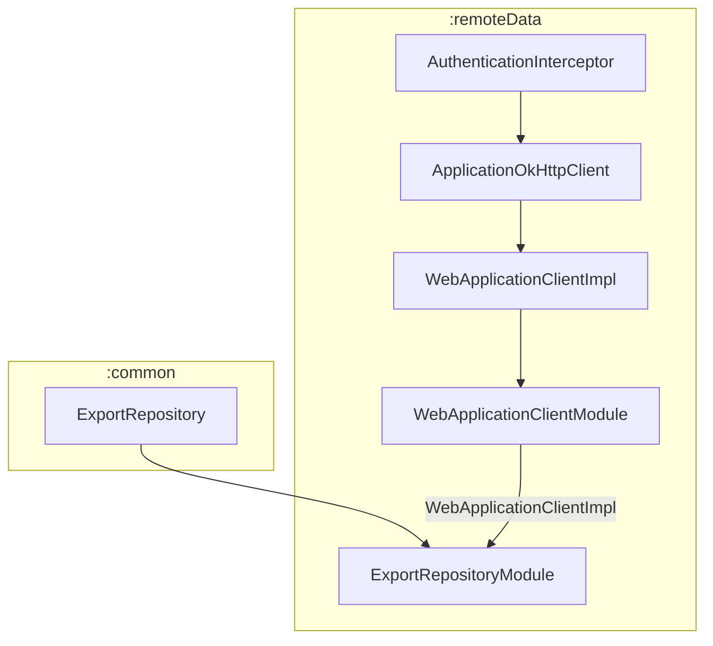
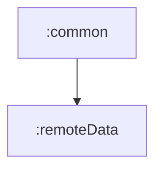

# 📦 Module :remoteData

## 📝 Overview

A module responsible for implementing the remote data layer using Retrofit and OkHttp. Defines HTTPS client configuration,
API endpoints, DTOs, and a repository implementation exposed to other modules via Hilt for dependency injection.

### 🔧 Key Functionalities

- Implements HTTPS client configuration with authentication and timeout settings
- Provides API endpoint definitions for remote services
- Handles data transformation between models and DTOs
- Implements repository pattern for remote data operations
- Manages error handling and response processing for network requests

---

## 🧠 Class Responsibilities

### `AuthenticationInterceptor`
OkHttp interceptor that automatically adds API key authentication headers to all outgoing requests.
Uses development API key from build configuration.

### `ApplicationOkHttpClient`
Configures and provides the OkHttp client instance. Serves as the base HTTPS client for all network requests.

### `WebApplicationClient`
Interface defining the contract for web application client implementations. Provides access API endpoints.

### `WebApplicationClientImpl`
Concrete implementation of `WebApplicationClient` that configures Retrofit with the base URL, OkHttp client, and JSON converter.
Creates and provides access to API endpoint implementations.

### `ExportEndpoints`
Retrofit interface defining the API endpoints for export operations. Contains the `downloadExport` endpoint for
requesting CSV file downloads.

### `DownloadExportRequestDto`
Data transfer object representing the request payload for export operations. Contains a list of words to export and
provides conversion utilities from domain models.

### `WordDto`
Data transfer object representing individual words in export requests. Maps domain `SavedWord` models to
API-compatible format.

### `ExportRepositoryImpl`
Remote implementation of `ExportRepository` that handles CSV export operations. Communicates with external services
via `ExportEndpoints`, processes responses, and handles error scenarios. Wraps all operations in `Result` to handle exceptions.

### `WebApplicationClientModule`
A Hilt module for binding `WebApplicationClient` interface with `WebApplicationClientImpl` as a singleton.

### `ExportRepositoryModule`
A Hilt module for providing `ExportRepository` implementation. Injects `WebApplicationClient` and creates `ExportRepositoryImpl` instance.

---

## 🧬 Class dependency graph

---

## 🧩 Module dependency graph

