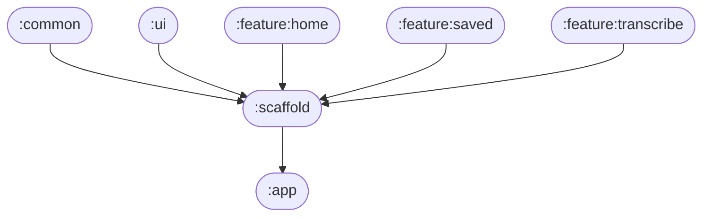

# 📦 Module :scaffold

## 📝 Overview

The scaffold module serves as the main UI orchestrator and navigation hub for the entire application. It provides the foundational structure that brings together all feature modules, navigation, and common UI components into a cohesive user experience. The module implements a Material3 Scaffold with integrated navigation, top bar, and floating action button, creating the app's main navigation framework.

### 🔧 Key Functionalities

- Provides the main application scaffold structure using Material3 design principles
- Orchestrates navigation between all feature modules using Compose Navigation
- Manages the top bar with dynamic content based on current screen
- Controls floating action button visibility and behavior across different screens
- Handles edge-to-edge display with proper status bar insets
- Integrates all feature implementations into a unified navigation system
- Manages navigation state and back stack handling

---

## 🧠 Class Responsibilities

### ``ApplicationScaffold``
Main composable function that serves as the root UI structure:
- Creates the Material3 Scaffold with proper theming and layout
- Sets up navigation controller and NavHost for screen routing
- Integrates top bar, floating action button, and content areas
- Manages edge-to-edge display with status bar insets
- Orchestrates all feature implementations and navigation flows

### ``topBarImpl``
Navigation implementation that integrates the top bar into the app:
- Sets up the top bar composable with navigation controller integration
- Manages top bar state through TopBarViewModel
- Handles navigation callbacks for back navigation and info display
- Provides dynamic content based on current route

### ``floatingActionButtonImpl``
Navigation implementation that integrates the floating action button:
- Sets up the floating action button composable with navigation integration
- Manages button visibility and state through FloatingActionButtonViewModel
- Provides context-aware functionality based on current screen
- Handles navigation to export words screen

### ``homeImpl``
Navigation implementation for the home feature:
- Sets up the home screen composable route
- Integrates with HomeViewModel for connectivity status
- Provides navigation callbacks to other features
- Handles navigation to saved words and transcribe screens

### ``savedWordsImpl``
Navigation implementation for the saved words feature:
- Sets up the saved words screen composable route
- Integrates with SavedWordsViewModel for data management
- Provides navigation callbacks for word management
- Handles navigation within the saved words flow

### ``exportWordsImpl``
Navigation implementation for the export words feature:
- Sets up the export words screen composable route
- Integrates with ExportWordsViewModel for export configuration
- Provides navigation callbacks for export settings
- Handles navigation to export result screen

### ``exportResultImpl``
Navigation implementation for the export result feature:
- Sets up the export result screen composable route
- Integrates with ExportResultViewModel for result handling
- Provides navigation callbacks for file saving
- Handles navigation parameters for export settings

### ``selectAudioImpl``
Navigation implementation for the audio selection feature:
- Sets up the select audio screen composable route
- Integrates with SelectAudioViewModel for audio handling
- Provides navigation callbacks for audio selection
- Handles navigation to transcription workflow

---

## 🏗️ Architecture

## 🧩 Module dependency graph

Shows which modules depend on `:scaffold` and which modules `:scaffold` itself depends on.

