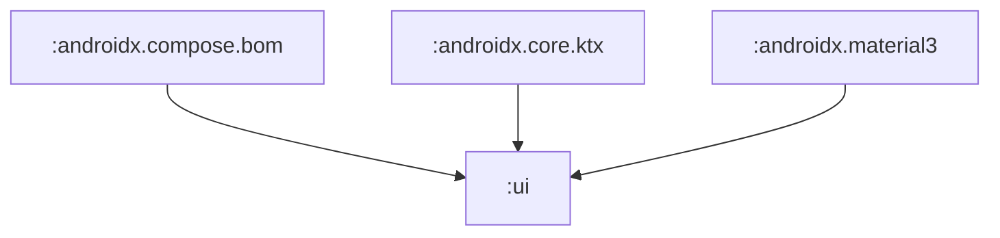
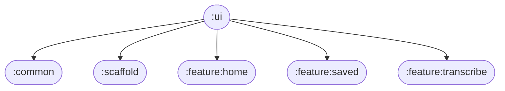

# 📦 Module :ui

## 📝 Overview

The UI module serves as the centralized design system and component library for the entire application. It provides reusable UI components, consistent theming, typography, colors, and standardized dimensions that ensure a cohesive and maintainable user interface across all features. The module follows Material3 design principles and implements a comprehensive component library that promotes consistency and reduces duplication.

### 🔧 Key Functionalities

- Provides a comprehensive library of reusable UI components
- Implements consistent Material3 design system and theming
- Defines standardized dimensions, spacing, and layout constants
- Offers typography system with custom font family (Inter)
- Manages color palette and theme consistency
- Provides responsive and accessible UI components
- Supports testing through integrated test tags

---

## 🧠 Class Responsibilities

### ``WarningBanner``
Reusable banner component for displaying warning messages:
- Displays warning icon with headline and body text
- Uses consistent warning color scheme and styling
- Implements proper spacing and corner radius
- Supports test tags for UI testing
- Provides consistent visual hierarchy

### ``PrimaryButton``
Main action button component for primary user interactions:
- Implements Material3 button design with custom colors
- Provides consistent height (56dp) and styling
- Supports disabled state with appropriate colors
- Integrates with typography system for text styling
- Includes test tag support for testing

### ``SecondaryButton``
Secondary action button for less prominent interactions:
- Follows Material3 design principles
- Maintains consistent styling with primary buttons
- Provides visual hierarchy distinction
- Supports disabled states and test tags

### ``TextButton``
Text-based button for tertiary actions:
- Minimal button design for less prominent actions
- Maintains accessibility and touch targets
- Consistent with overall button system

### ``IconButton``
Icon-based button component:
- Supports both primary and secondary icon buttons
- Maintains consistent sizing and touch targets
- Integrates with icon system and theming

### ``SecondaryIconButton``
Secondary variant of icon button:
- Provides visual distinction from primary icon buttons
- Maintains consistent behavior and accessibility

### ``Checkbox``
Custom checkbox component:
- Implements Material3 checkbox design
- Supports custom colors and states
- Maintains accessibility standards

### ``Headline Components``
Typography components for different headline levels:
- `headlineLarge` - Main page titles (32sp, Bold)
- `headlineMedium` - Section headers (24sp, Bold)
- `headlineSmall` - Subsection headers (16sp, Bold)
- Consistent text alignment and color usage

### ``Body Components``
Text components for body content:
- `bodyLarge` - Main content text (16sp, Normal)
- `bodySmall` - Secondary content text (12sp, Normal)
- Consistent typography and color application

### ``Label Components``
Text components for labels and captions:
- `labelLarge` - Primary labels (16sp, SemiBold)
- `labelMedium` - Secondary labels (12sp, SemiBold)
- Used for form elements and UI labels

### ``Spacer Components``
Layout utilities for consistent spacing:
- `spacerH8` - Horizontal spacing (8dp)
- `spacerV8` - Vertical spacing (8dp)
- `spacerVertical32` - Large vertical spacing (32dp)
- Ensures consistent spacing throughout the app

### ``Color System``
Centralized color palette management:
- **Primary Colors**: Primary, OnPrimary, Background
- **Semantic Colors**: WarningBanner, Disabled
- **Text Colors**: PrimaryWhite, SecondaryWhite
- **UI Colors**: Divider
- Ensures consistent color usage across components

### ``Typography System``
Custom typography implementation:
- **Font Family**: Inter font family for consistency
- **Type Scale**: Comprehensive range from 12sp to 32sp
- **Weight Variants**: Normal, SemiBold, Bold
- **Line Heights**: Optimized for readability
- **Responsive Design**: Scalable typography system

### ``Dimension System``
Standardized layout constants:
- **ScreenPadding**: 16dp for screen margins
- **WidgetPadding**: 16dp for component spacing
- **BetweenWidgetsPadding**: 32dp for component separation
- **ThumbReachPadding**: 90dp for thumb-friendly positioning
- **WidgetCornerRadius**: Consistent corner radius
- **TouchTarget**: Minimum touch target sizes

---

## 🏗️ Architecture

The UI module follows a component-based architecture with clear separation of concerns:

```
ui/
├── components/           # Reusable UI components
│   ├── banners/         # Banner components
│   ├── buttons/         # Button variants
│   ├── checkboxes/      # Form components
│   ├── spacers/         # Layout utilities
│   └── text/            # Typography components
├── dimensions/           # Layout constants
├── theme/               # Design system
│   ├── Color.kt         # Color palette
│   └── Typography.kt    # Typography system
└── README.md            # This documentation
```

### 🧬 Module dependency graph



## 🧩 Module dependency graph

Shows which modules depend on `:ui` and which modules `:ui` itself depends on.



## 🎨 Design System

### **Color Palette**
- **Primary**: #FFFFFF (White) - Main brand color
- **Background**: #141414 (Dark) - App background
- **WarningBanner**: #002E38 (Dark Teal) - Warning states
- **PrimaryWhite**: #EDEDED (Light Gray) - Primary text
- **SecondaryWhite**: #A6A6A6 (Medium Gray) - Secondary text
- **OnPrimary**: #141414 (Dark) - Text on primary surfaces
- **Divider**: #2B2B2B (Medium Dark) - Separator lines
- **Disabled**: #5A5A5A (Gray) - Disabled states

### **Typography Scale**
- **Headline Large**: 32sp, Bold, Inter
- **Headline Medium**: 24sp, Bold, Inter
- **Headline Small**: 16sp, Bold, Inter
- **Body Large**: 16sp, Normal, Inter
- **Body Small**: 12sp, Normal, Inter
- **Label Large**: 16sp, SemiBold, Inter
- **Label Medium**: 12sp, SemiBold, Inter

### **Spacing System**
- **8dp**: Small spacing between related elements
- **16dp**: Standard padding and margins
- **32dp**: Large spacing between sections
- **90dp**: Thumb-friendly positioning